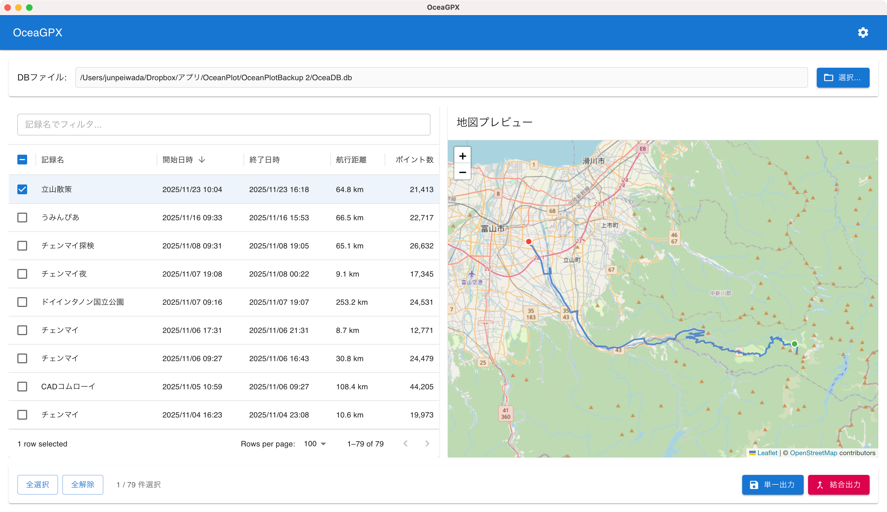

# OceaGPX

OceanPlotのSQLiteデータベースから航跡データを読み込み、GPXファイルとして出力するmacOSアプリケーション。

## 概要

OceaGPXは、iOSアプリ「OceanPlot」で記録した航跡データをGPXフォーマットに変換するためのデスクトップアプリです。出力したGPXファイルはAdobe Lightroom Classicで写真にジオタグを付与する際に使用できます。

## 機能

- **データベース読み込み**: OceanPlotのSQLiteデータベース（.db）を読み込み
- **記録一覧表示**: 記録名、開始/終了日時、航行距離、ポイント数を一覧表示
- **地図プレビュー**: 選択した航跡をOpenStreetMap上にプレビュー表示
- **GPX出力**:
  - 単一出力: 各記録を個別のGPXファイルとして出力
  - 結合出力: 複数記録を1つのGPXファイルにまとめて出力
- **ドラッグ&ドロップ**: DBファイルのD&D読み込み対応
- **設定保存**: ウィンドウサイズ、出力先フォルダなどを記憶

## スクリーンショット



## 動作環境

- macOS 10.15 (Catalina) 以降
- Apple Silicon / Intel Mac 対応

## インストール

### リリース版

[Releases](../../releases)ページから最新の`.dmg`ファイルをダウンロードしてインストールしてください。

### ソースからビルド

```bash
# リポジトリをクローン
git clone https://github.com/yourusername/OceaGPX.git
cd OceaGPX

# 依存関係をインストール
npm install

# 開発モードで実行
npm run dev

# プロダクションビルド
npm run build

# 配布パッケージを作成
npm run dist
```

## 使い方

1. アプリを起動
2. 「選択...」ボタンまたはドラッグ&ドロップでOceanPlotのデータベースファイル（OceaDB.db）を読み込み
3. 出力したい記録をチェックボックスで選択
4. 地図プレビューで航跡を確認
5. 「単一出力」または「結合出力」ボタンでGPXファイルを出力

### Lightroom Classicでの使用

1. OceaGPXで出力したGPXファイルを用意
2. Lightroom Classicで「マップ」モジュールを開く
3. メニュー「マップ」→「トラックログを読み込み」でGPXを読み込み
4. 「マップ」→「写真を自動タグ」でジオタグを付与

## 技術スタック

- [Electron](https://www.electronjs.org/) - クロスプラットフォームデスクトップアプリ
- [TypeScript](https://www.typescriptlang.org/) - 型付きJavaScript
- [React](https://react.dev/) - UIライブラリ
- [MUI (Material UI)](https://mui.com/) - UIコンポーネント
- [Leaflet](https://leafletjs.com/) / [React-Leaflet](https://react-leaflet.js.org/) - 地図表示
- [better-sqlite3](https://github.com/WiseLibs/better-sqlite3) - SQLiteデータベースアクセス
- [Webpack](https://webpack.js.org/) - モジュールバンドラー

## 開発

```bash
# 開発サーバー起動（ホットリロード有効）
npm run dev

# 型チェック
npm run typecheck

# リント
npm run lint

# ビルド
npm run build

# better-sqlite3の再ビルド（Electronバージョン変更時）
npm run rebuild
```

## ライセンス

MIT License

## 関連プロジェクト

- [OceanPlot](https://apps.apple.com/app/oceanplot/id1234567890) - iOS向け航跡記録アプリ
